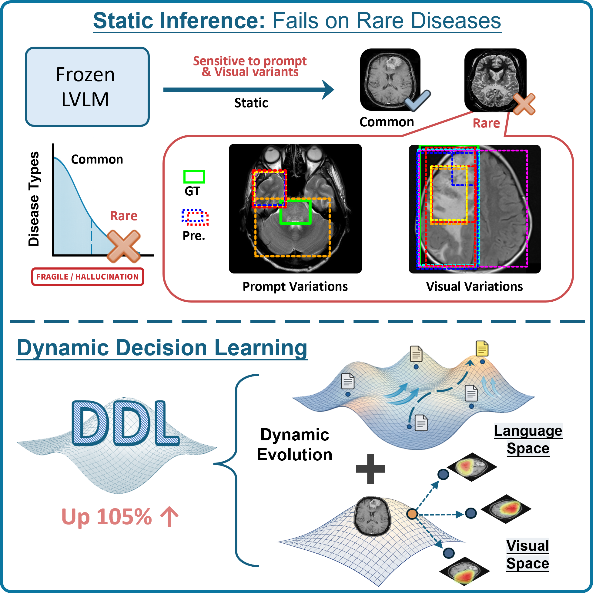

**Figure 1: revised teaser.** **Top**: Static inference with frozen LVLMs exhibits prompt and perturbation sensitivity on rare pathologies, leading to unstable and hallucinated localizations. **Bottom**: DDL performs test-time prompt optimization and multi-view verification, yielding substantially more stable and reliable localizations.

---

  

**Figure 2:** The image shows that when faced with true anomaly, the prediction is usually consistent, and DDL will also have a high CRS score; whereas when the first original anchor is wrong, the other peer-evaluation predictions will not stick to the true anomaly, and the CRS will be low.
